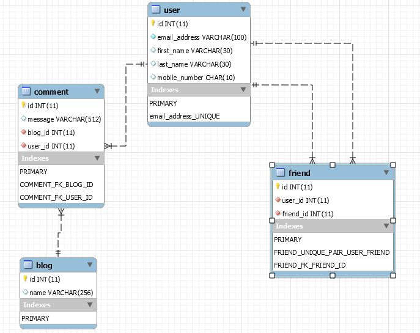
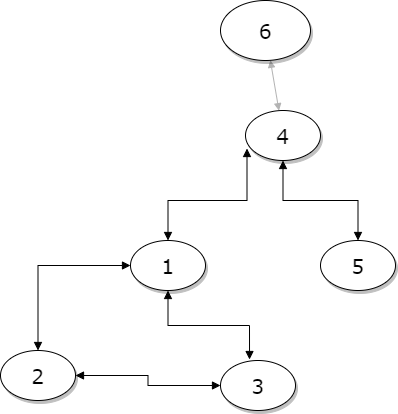
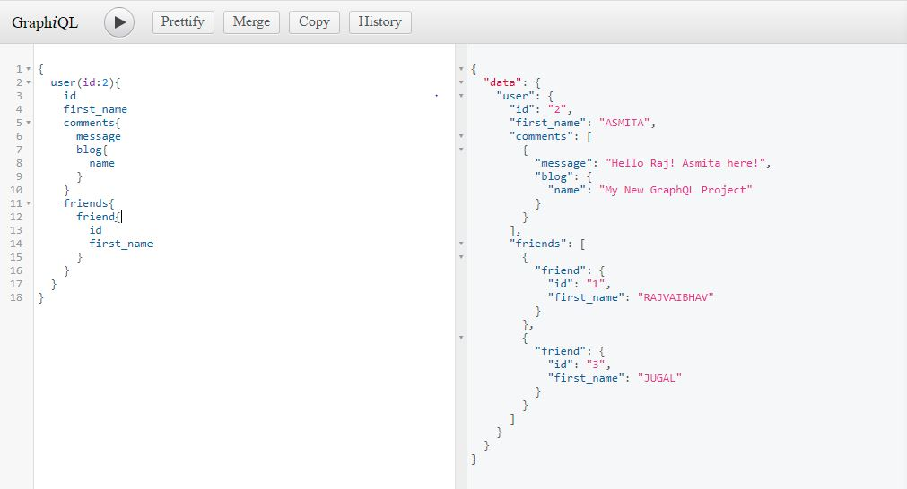
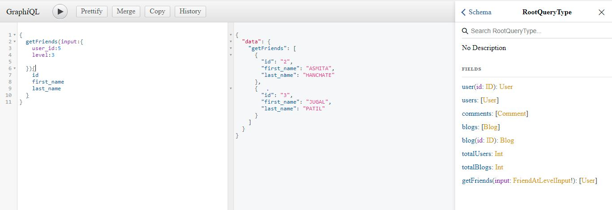
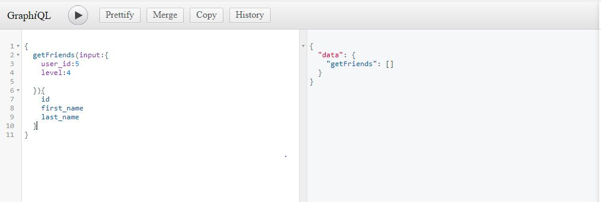
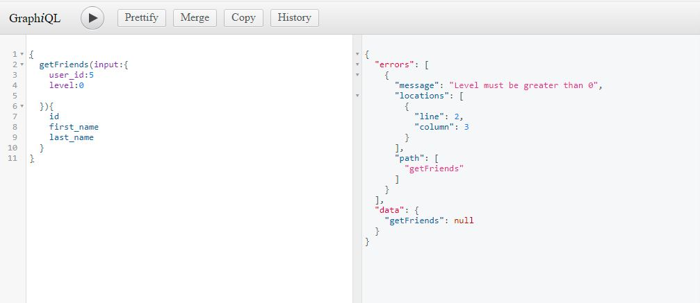
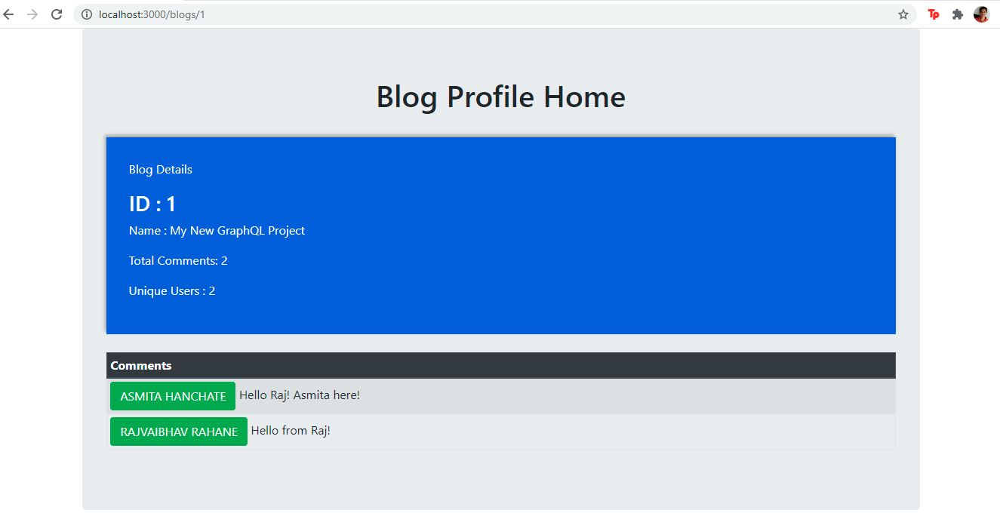
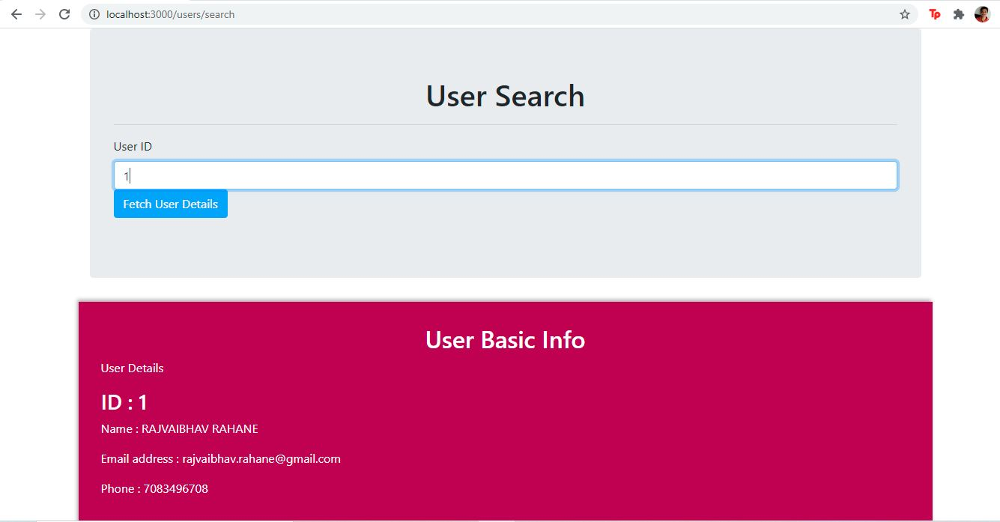

# Swasthya-AI-Placement-GraphQL-Server
GraphQL server for Swasthya AI Placement Assignment

Visit the <a href='https://github.com/Rajrahane/Swasthya-AI-Placement-React-Server'>React Client Repository</a>

Run the MYSQL script dump_2329_22052021.sql on MySQL Workbench 
Steps to install and run GraphQL and React Servers: 
1. clone the repository (git clone repo.git)
2. run npm install
3. change the username,password for GraphQL dbConnection/dbConnection.js
4. run npm start
5. view the GraphQL server on http://localhost:4000/graphql
6. view the React Server on http://localhost:3000/

<h4>Approach:</h4>
<b>DB Schema:</b>

Create 4 tables: User, Blog, Comment, Friend 
<ul>
<li>User Table: id,first_name,last_name,mobile_number,email_address</li>
<li>Blog Table: id,name</li>
<li>Comment Table: id,message,user_id,blog_id</li>
<li>Friend Table: id,user_id,friend_id 
Friend table adds a given friend to the user's friendList.</li>
  </ul>
Assumption: Friends is undirected connection,two entries would be made- for a pair of friends A,B as (A,B) and (B,A).
  
<b>React UI:</b> 
/users Endpoint: User can Register, Search, View Profile 
/blogs Endpoint: A new Blog can be created.Search Blog based on ID. 
Blog Profile shows blog name and lists the comments. 
 
<b>Summary</b> 
<ul>
<li>Create a DB schema in MYSQL for the tables.</li>
<li>Create a GraphQL Schema to fetch data, create new User and Blog, post a new Comment.</li>
<li>Create getFriends RootQuery in GraphQL to fetch Nth Level Friend of a User</li>
<li>Create a React Frontend for Forms, Search, Profile.</li>
</ul>

<b>Solution for Nth Level Friend List:</b> 
Create a Friends graph and make a BFS recursive call until Nth level. 
<pre>
Consider input as (user_id:int,givenLevel:int) returns list(users)
   Initialize an empty Set of VisitedUsers
   Initialize an empty queue.Push (user_id) into it
   Initialize currentLevel=0
   while(q is not empty and currentLevel lessthan givenLevel){
      init new empty queue q2
      while(q not empty){
        pop each user.
        if(user not visited){
            mark as visited in VisitedUsers
            fetch all friends ids from Friends table in Database
            foreach(friend){
              if(friend not visited){
                push friend to queue q2
              }
            }
         }
      }
      currentLevel++
      push all elements in q2 to q, i.e. q=q2
   }
   if(currentLevel less than givenLevel){ //no nth level depth possible, too few levels
      return empty list
   }
   return to_list(q)
</pre>

<b>Sample Database Data:</b> 
1. 7 users are created 
2. 2 blogs are created 
3. 1st blog has 2 comments added 
4. To mock friend relations, 6 relations are created {1,2,3}, {1,4}, {4,6}, {4,5} 

<b>Sample GraphQL Query for getFriends at any level:</b>
<pre>
{
  getFriends(input:{
    user_id:5
    level:3
  }){
    id
    last_name
  }
}
</pre>
Expected Output: Users 2 and 3 
Explanation: User 5 has 1st level friend- User 4 
User 5 has 2nd level friends- User 1,6 via User 4 
User 5 has 3rd level friends- User 2,3 via User 1 

<b>Sample Query for edge case (level too high or level<=0)</b>
<pre>
{
  getFriends(input:{
    user_id:5
    level:4
  }){
    id
    last_name
  }
}
</pre>
Expected Ouput: null list 
Explanation: User 5 has friends upto level 3 only
 
 

<b>Improvements:</b> 
   <ul>
   <li><b>DFS</b> can be used instead of BFS if some(say 10) and not all users are to be fetched.</li>
   <li><b><a href="https://neo4j.com/developer/graph-database/">Graph DB - Neo4j</a></b> can be used instead of MySQL, since a friends graph is formed</li>
<li>Pagination can be used to fetch Comments from GraphQL.</li>
<li><b>GraphQL caching</b> can be used for query caching</li>
</ul>
<b>Deployment:</b> 
   <li>GraphQL can be hosted over <a href="https://aws.amazon.com/lambda/">AWS Lambda</a> + <a href="https://aws.amazon.com/api-gateway/">API Gateway</a></li>
<li><a href="https://aws.amazon.com/cdk/">AWS CDK</a> or <a href="https://aws.amazon.com/serverless/sam/">AWS SAM</a> can be setup for Deployment of Lambda Code from Repository</li>

<b>React JS UI Snaps</b>

